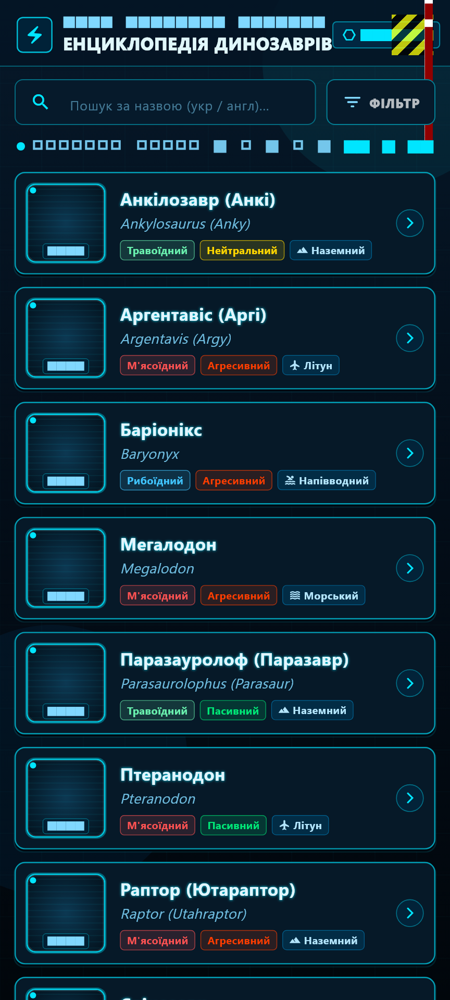
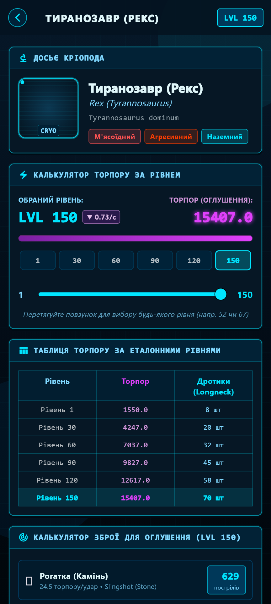
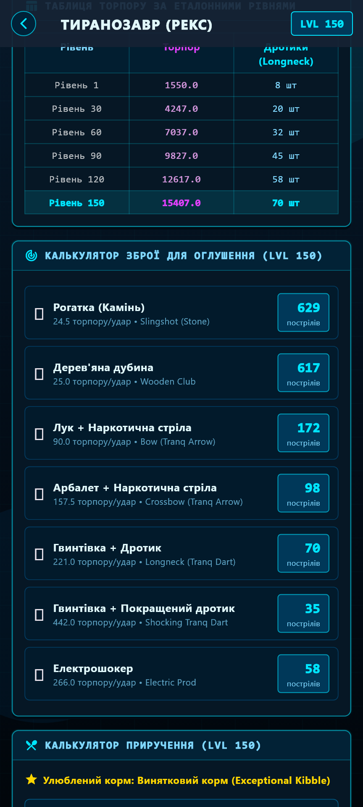

# 🦖 ARK: Survival Evolved — FanWiki & Taming Calculator

<div align="center">


<p align="center">
  <b>Сучасна інтерактивна енциклопедія та калькулятор приручення для гравців ARK: Survival Evolved.</b><br>
  Розроблено на Flutter з неоновим Sci-Fi інтерфейсом у стилі голографічного терміналу ARK.
</p>

[**📥 Завантажити останній APK (v1.0.0)**](https://github.com/RostUAGamer/ARK-Evolved-FanWiki/releases/latest) • [**🐛 Повідомити про баг**](https://github.com/RostUAGamer/ARK-Evolved-FanWiki/issues) • [**💡 Запропонувати ідею**](https://github.com/RostUAGamer/ARK-Evolved-FanWiki/issues)

</div>

---

## 📑 Зміст
- [📸 Скріншоти додатку](#-скріншоти-додатку)
- [🏆 Досягнення проекту](#-досягнення-проекту)
- [⚡ Основні можливості](#-основні-можливості)
- [🛠 Стек технологій](#-стек-технологій)
- [📦 Як встановити APK на Android](#-як-встановити-apk-на-android)
- [💻 Інструкція для розробників](#-інструкція-для-розробників)
- [📄 Ліцензія](#-ліцензія)

---

## 📸 Скріншоти додатку

<div align="center">

| 1. Головний екран (Істоти) | 2. Досьє та Калькулятор Торпору | 3. Калькулятор Зброї Оглушення |
| :---: | :---: | :---: |
|  |  |  |

| 4. Калькулятор Корму та Часу | 5. Багаторівнева Фільтрація |
| :---: | :---: |
|  |  |

</div>

---

## 🏆 Досягнення проекту

<table>
  <thead>
    <tr>
      <th width="80">Статус</th>
      <th width="200">Досягнення</th>
      <th>Опис та реалізація</th>
    </tr>
  </thead>
  <tbody>
    <tr>
      <td align="center">✅</td>
      <td><b>🚀 Перший реліз v1.0.0</b></td>
      <td>Сформовано перший стабільний публічний реліз додатку з готовим APK для Android пристроїв.</td>
    </tr>
    <tr>
      <td align="center">✅</td>
      <td><b>🦖 База Досьє Істот</b></td>
      <td>Детальний каталог динозаврів ARK з українськими та оригінальними назвами, біомами, дієтою та поведінкою.</td>
    </tr>
    <tr>
      <td align="center">✅</td>
      <td><b>⚡ Точний розрахунок Торпору</b></td>
      <td>Динамічний розрахунок показників оглушення від 1 до 150 рівня за офіційними формулами ARK Wiki з таблицею контрольних точок.</td>
    </tr>
    <tr>
      <td align="center">✅</td>
      <td><b>🎯 Калькулятор Зброї</b></td>
      <td>Розрахунок кількості влучань для 7 видів зброї (Рогатка, Дубина, Лук, Арбалет, Гвинтівка, Шоковий дротик, Електрошокер) з урахуванням модифікаторів влучань у голову.</td>
    </tr>
    <tr>
      <td align="center">✅</td>
      <td><b>🥩 Калькулятор Приручення</b></td>
      <td>Розрахунок потрібної кількості улюбленого кіблу (корму), м'яса, баранини, часу приручення на рейтах 1x, бонусних рівнів та наркотиків для підтримання сну.</td>
    </tr>
    <tr>
      <td align="center">✅</td>
      <td><b>🎨 Голографічний Sci-Fi HUD</b></td>
      <td>Кастомні віджети з неоновим бірюзово-фіолетовим підсвічуванням, анімацією скануючих ліній, кріоподами та кіберпанк-контейнерами.</td>
    </tr>
    <tr>
      <td align="center">✅</td>
      <td><b>🔍 Розумний пошук та фільтри</b></td>
      <td>Миттєвий пошук двома мовами (UA/EN) та фільтрація за раціоном харчування, агресивністю і середовищем (наземні, літуни, морські, напівводні).</td>
    </tr>
    <tr>
      <td align="center">✅</td>
      <td><b>🤖 Автоматизований CI/CD</b></td>
      <td>Налаштовано GitHub Actions конвеєр для безперервної інтеграції, валідації лінтерами та автоматичного прогону тестів на кожен пуш.</td>
    </tr>
    <tr>
      <td align="center">🎯</td>
      <td><b>🧬 Калькулятор Розведення (Roadmap)</b></td>
      <td><i>У розробці:</i> Розрахунок часу інкубації яєць, дорослішання дитинчат та інтервалів годування.</td>
    </tr>
    <tr>
      <td align="center">🎯</td>
      <td><b>🗺 Інтерактивні Карти (Roadmap)</b></td>
      <td><i>У розробці:</i> Візуалізація зон спавну істот та родовищ ресурсів (The Island, Scorched Earth тощо).</td>
    </tr>
  </tbody>
</table>

---

## ⚡ Основні можливості

- **🗂 Каталог Істот:**
  - Детальна картка кожної істоти з фотографією, біологічною назвою та середовищем існування.
  - Швидка ідентифікація раціону (Травоїдний / М'ясоїдний / Рибоїдний) та темпераменту (Пасивний / Нейтральний / Агресивний).
- **📊 Повний розрахунок приручення (Taming Engine):**
  - Вибір будь-якого рівня істоти від 1 до 150 за допомогою зручного слайдера або швидких кнопок (1, 30, 60, 90, 120, 150).
  - Швидкість падіння торпору (торпор/сек) для планування необхідної кількості наркотиків чи біо-токсину.
  - Точна кількість корму кожного типу, орієнтовний час годівлі та фінальна ефективність приручення.
- **🏹 Арсенал приборкання:**
  - Порівняльна таблиця пострілів для всієї доступної зброї в грі.
  - Перемикач для тварин з модифікатором влучання в голову (наприклад, птеранодон або тріцератопс).
- **🏃‍♂️ Базові показники швидкості:**
  - Швидкість ходьби, бігу (спринту), плавання та польоту для кожної істоти.

---

## 🛠 Стек технологій

- **Фреймворк:** [Flutter](https://flutter.dev/) (Channel stable, Dart 3.13+)
- **Дизайн та інтерфейс:** Material 3 Dark Theme, Custom Sci-Fi / Cyberpunk Hologram Canvas, Custom Painters
- **Управління станом:** StatefulWidgets з реактивними фільтрами
- **Тестування:** `flutter_test` (Unit & Widget Smoke Tests)
- **Контроль версій & CI:** Git, GitHub Releases, GitHub Actions (Ubuntu CI runner)

---

## 📦 Як встановити APK на Android

1. Перейдіть до розділу [**Releases**](https://github.com/RostUAGamer/ARK-Evolved-FanWiki/releases/latest).
2. Завантажте файл `ARK-Evolved-FanWiki-v1.0.0.apk`.
3. Відкрийте завантажений файл на вашому Android смартфоні.
4. Якщо телефон запитає дозвіл — дозвольте встановлення з невідомих джерел для вашого браузера або провідника.
5. Готово! Запускайте додаток та насолоджуйтесь енциклопедією.

---

## 💻 Інструкція для розробників

### Вимоги:
- Встановлений [Flutter SDK](https://docs.flutter.dev/get-started/install) (версія 3.13 або вище)
- Android SDK / емулятор або фізичний пристрій Android

### Кроки запуску:
```bash
# 1. Клонувати репозиторій
git clone https://github.com/RostUAGamer/ARK-Evolved-FanWiki.git

# 2. Перейти до папки проекту
cd ARK-Evolved-FanWiki

# 3. Встановити залежності
flutter pub get

# 4. Запустити тести
flutter test

# 5. Запустити додаток на пристрої
flutter run
```

---

## 📄 Ліцензія

Проект розповсюджується під відкритою ліцензією **[MIT License](LICENSE)**.  
Ви можете вільно використовувати, змінювати та поширювати цей код.

---

<div align="center">
  Розроблено з ❤️ для спільноти гравців <b>ARK: Survival Evolved</b>
</div>
